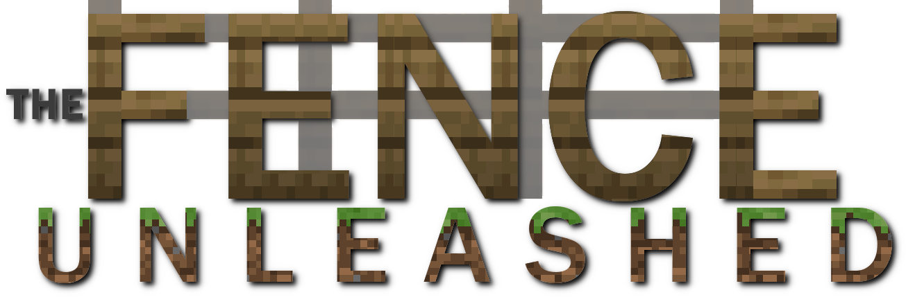
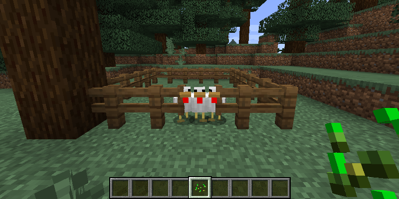

# The Fence Unleashed

<p align="center">
  
</p>

**Have you ever been annoyed by that one cow that just didn't want to stay in
its pen and managed to get out just before you could close the fence gate?**

_The Fence Unleashed_ is a small QoL mod that helps in exactly this scenario by
preventing mobs that are not leashed from passing through fence gates. The mod
uses an algorithmic approach to determine if an entity may pass through a fence
gate and changes the behavior accordingly.

The Fence Unleashed's generic implementation makes the mod compatible with many
custom fence gates and mobs. However, the behavior for some mobs from other mods
may be inferred incorrectly. For this case, the mod provides a configuration
file (`the-fence-unleashed.toml` in the `config` folder) which can be used to
tweak the mod's algorithm as needed.

<p align="center">
  
</p>


## Versioning

The Fence Unleashed follows a custom versioning scheme that follows the spirit
of the [SemVer 2.0.0](https://semver.org/spec/v2.0.0.html) specification. 

Given a version number `WORLD.API.FEATURE-MC-LOADER.PATCH`, increment the:

1. `WORLD` version when you make save-game incompatible changes,
2. `API` version when you make incompatible API changes,
3. `FEATURE` version when you update functionality in a backwards compatible
   manner
4. `LOADER` version when you update to a backward incompatible version of your
   mod loader (e.g. Forge)
5. `PATCH` version when you make backwards compatible bug fixes

The `MC` version should always be the version string of the targeted version of
Minecraft. If multiple Minecraft versions are supported by a single mod version,
typically the oldest supported version string should be chosen.


## Supported versions

| Minecraft Version                                                     | State              |
|-----------------------------------------------------------------------|--------------------|
| 1.21                                                                  | Mainline           |
| [1.20](https://github.com/TheMrMilchmann/TheFenceUnleashed/tree/1.20) | Active Development |
| [1.19](https://github.com/TheMrMilchmann/TheFenceUnleashed/tree/1.19) | Maintenance Mode   |
| [1.18](https://github.com/TheMrMilchmann/TheFenceUnleashed-1.18)      | Maintenance Mode   |
| [1.17](https://github.com/TheMrMilchmann/TheFenceUnleashed-1.17)      | Unsupported        |
| [1.16](https://github.com/TheMrMilchmann/TheFenceUnleashed-1.16)      | Unsupported        |

**This is the mainline branch** for the development of _The Fence Unleashed_
which usually targets the most recent Minecraft version. The development for
other versions of Minecraft happens in the repositories and branches linked in
the table above.


### Support Cycle

| State                  | Description                                                  |
|------------------------|--------------------------------------------------------------|
| **Mainline**           | The primary development branch                               |
| **Active Development** | This version still receives all updates                      |
| **Maintenance Mode**   | This version still receives fixes but no new features        |
| **Unsupported**        | This version is unsupported and does not receive any updates |


## Frequently Asked Questions
(Just kidding, we just released this. No one has asked for or about this.)

> Why is this mod called "The Fence Unleashed" when it actually improves fence gates?

Excellent question! Did you ever come up with a pun about fence gates? No? Yeah,
I didn't either. That's pretty much it... so I guess I'll add another random
fact here: The initial name for this mod was "Fency" (and this name is still
used internally) but it had to be changed for technical reasons.

> Is The Fence Unleashed compatible with fence gates added by other mods?

The Fence Unleashed modifies vanilla fence gate logic to be compatible with all
sorts of fence gates. Thus, it is very likely, but not guaranteed that it will
work with fence gates from other mods too.

> Can I use The Fence Unleashed in my modpack?

Yes, please respect the [license terms](./LICENSE).

> Can I use this mod with existing saves?

Yes, The Fence Unleashed does not affect savegames. It can be added or removed
at any time.

> Mob X from mod Y behaves weirdly with The Fence Unleashed. Is there anything I
> can do about this?

While The Fence Unleashed can usually correctly identify whether a mob can be
leashed and adjusts the behavior accordingly, some mods do not correctly
implement the required checks. To make sure that this gets fixed properly,
please file an [issue](https://github.com/TheMrMilchmann/TheFenceUnleashed/issues).
You do not have to wait for a fix, however. Fortunately, The Fence Unleashed
provides a configuration file in which its behavior can be adjusted.


## Building from source

### Setup

This project uses [Gradle's toolchain support](https://docs.gradle.org/8.8/userguide/toolchains.html)
to detect and select the JDKs required to run the build. Please refer to the
build scripts to find out which toolchains are requested.

An installed JDK 1.8 (or later) is required to use Gradle.

### Building

Once the setup is complete, invoke the respective Gradle tasks using the
following command on Unix/macOS:

    ./gradlew <tasks>

or the following command on Windows:

    gradlew <tasks>

Important Gradle tasks to remember are:
- `clean`                   - clean build results
- `build`                   - assemble and test the Java library
- `runClient`               - runs the development client
- `runServer`               - runs the development server

Additionally `tasks` may be used to print a list of all available tasks.


## License

```
Copyright (c) 2021-2023 Leon Linhart,
All rights reserved.

Redistribution and use in source and binary forms, with or without
modification, are permitted provided that the following conditions are met:

1. Redistributions of source code must retain the above copyright notice,
   this list of conditions and the following disclaimer.

2. Redistributions in binary form must reproduce the above copyright notice,
   this list of conditions and the following disclaimer in the documentation
   and/or other materials provided with the distribution.

3. Neither the name of the copyright holder nor the names of its contributors
   may be used to endorse or promote products derived from this software
   without specific prior written permission.

4. Redistributions of the software or derivative works, in any form, for
   commercial purposes, are strictly prohibited without the express written
   consent of the copyright holder. For the purposes of this license,
   "commercial purposes" includes, but is not limited to, redistributions
   through applications or services that generate revenue through
   advertising. This clause does neither not apply to "community contributions",
   as defined by the act of submitting changes or additions to the software,
   provided that the contributors are not copyright holders of the software, nor
   does it apply to derivatives of the software.

5. Any modifications or derivatives of the software, whether in source or binary
   form, must be made publicly available under the same license terms as this
   original license. This includes providing access to the modified source code.

THIS SOFTWARE IS PROVIDED BY THE COPYRIGHT HOLDERS AND CONTRIBUTORS "AS IS"
AND ANY EXPRESS OR IMPLIED WARRANTIES, INCLUDING, BUT NOT LIMITED TO, THE
IMPLIED WARRANTIES OF MERCHANTABILITY AND FITNESS FOR A PARTICULAR PURPOSE
ARE DISCLAIMED. IN NO EVENT SHALL THE COPYRIGHT HOLDER OR CONTRIBUTORS BE
LIABLE FOR ANY DIRECT, INDIRECT, INCIDENTAL, SPECIAL, EXEMPLARY, OR
CONSEQUENTIAL DAMAGES (INCLUDING, BUT NOT LIMITED TO, PROCUREMENT OF
SUBSTITUTE GOODS OR SERVICES; LOSS OF USE, DATA, OR PROFITS; OR BUSINESS
INTERRUPTION) HOWEVER CAUSED AND ON ANY THEORY OF LIABILITY, WHETHER IN
CONTRACT, STRICT LIABILITY, OR TORT (INCLUDING NEGLIGENCE OR OTHERWISE)
ARISING IN ANY WAY OUT OF THE USE OF THIS SOFTWARE, EVEN IF ADVISED OF THE
POSSIBILITY OF SUCH DAMAGE.
```